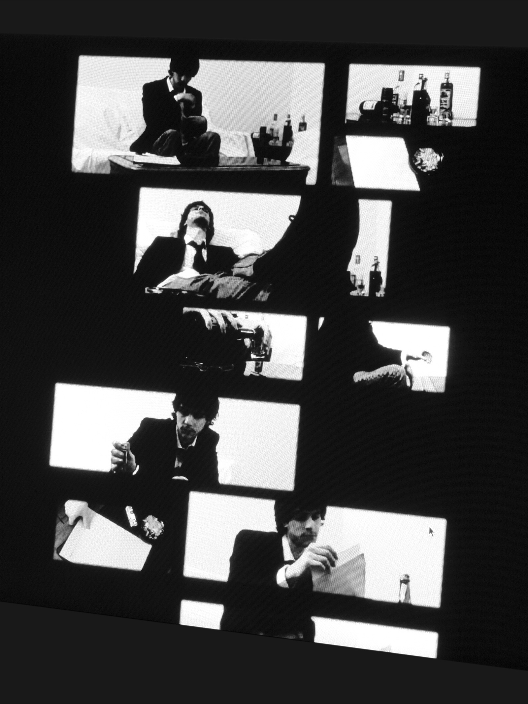
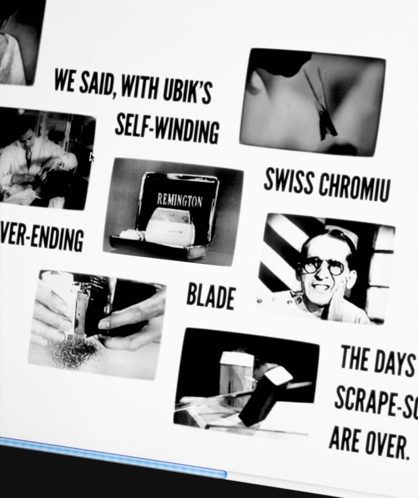

# Medlay

Medlay is a hybrid media form concept for crafting a multimedia artefact to narrate a story and/or communicate an idea on the Web.

You can learn more about the concept in the [following notes](http://ranbureand.github.io/medlay/ "Medlay / Hybrid media form concept").

